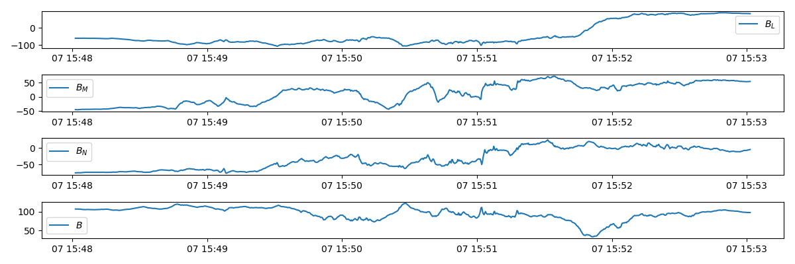
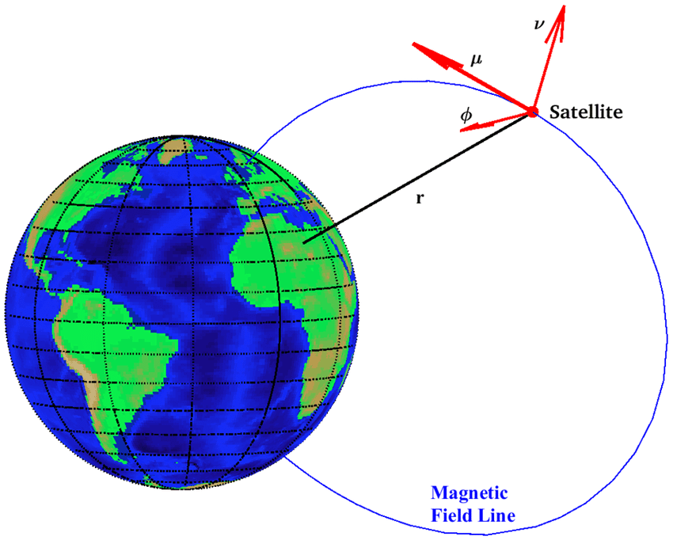

# Data Analysis in Space Physics

## Diffusion Region Detection

Magnetic reconnection occurs in a small diffusion region around the X-line but its consequences are large scale. There are different approaches to determine whether or not we have encountered the diffusion region. The expected kinetic signatures of diffusion region:
- enhanced dissipation
- non-gyrotropic behavior
- electron distribution functions

The first proposed [non-gyrotropy measure](https://doi.org/10.1029/2008JA013035) by Jack Scudder and William Daughton is
```math
AØ_e = 2\frac{|P_{\perp1} - P_{\perp2}|}{P_{\perp1} + P_{\perp2}}
```
which only considers the non-gyrotropy in the plane perpendicular to the magnetic field.

[Another measure of non-gyrotropy](https://aip.scitation.org/doi/full/10.1063/1.4820953) ``D_{ng}`` of a specific population proposed by researchers can be think of a ratio between off-diagonal terms and diagonal terms of the pressure tensor:
```math
D_{ng} = \frac{2\sqrt{\sum_{i,j, i\neq j}P_{ij}^2}}{\sum_{i=1,3}P_{ii}^2}
```
Note that this is frame independent and population specific.

However, Marc Swisdak later demonstrated in his [paper](https://doi.org/10.1002/2015GL066980) that a better measure from positive semi-definite matrix analysis should be
```math
Q = \frac{P_{12}^2 + P_{23}^2 + P_{31}^2}{P_\perp^2 + 2P_\perp P_\parallel} = 1- 4\frac{I_2}{(I_1 - P_\parallel)(I_1 + 3P_\parallel)}
```
where ``I_1=P_{xx}+P_{yy}+P_{zz}`` is the trace and ``I_2=P_{xx}P_{yy}+P_{xx}P_{zz}+P_{yy}P_{zz}-(P_{xy}P_{yx}+P_{xz}P_{zx}+P_{yz}P_{zy})`` is the principle minor, both of which are invariants under coordinate rotation. (The third invariant is the determinant.) This indeed peak near the center of X-line while is enhanced along the separatrices, which is better than ``D_{ng}`` in the sense that the latter may not peak at the diffusion region.

It has been found from PIC simulations that especially in asymmetric reconnection, ``E_M^\ast\neq 0`` where ``\mathbf{E}^\ast=\mathbf{E}+\mathbf{V}_e\times\mathbf{B}`` is not a good enough indicator. Following [the principle ideas of finding a measure](https://journals.aps.org/prl/abstract/10.1103/PhysRevLett.106.195003#fulltext):
- dissipation should be related to non-ideal energy conversion;
- scalar indicator;
- insensitive to the relative motion,

a frame independent [dissipation measure](https://journals.aps.org/prl/abstract/10.1103/PhysRevLett.106.195003#fulltext) is constructed,
```math
D_e = \gamma_e\big[\mathbf{J}\cdot(\mathbf{E}+\mathbf{V}_e\times\mathbf{B}) - (n_i - n_e)(\mathbf{V}_e\times\mathbf{E})\big]
```
which is a Lorentz-invariant scalar representing the energy conversion rate in the frame of electron bulk motion. In the nonrelativistic limit, one can simplify the equation by setting ``\gamma_e\rightarrow 1``. This can be easily confirmed by multiplying ``\mathbf{j}^\prime=qn_i\mathbf{V}_i=\mathbf{j}-\rho_c\mathbf{V}_e`` and ``\mathbf{E}^\prime = \mathbf{E}+\mathbf{V}\times\mathbf{B}``.

This is another good indicator of the electron diffusion region, although it is slightly enhanced along the separatrices as well.

[An alternative and complementary approach](https://agupubs.onlinelibrary.wiley.com/doi/full/10.1002/2016GL069034) is to identify diffusion region candidates by a combination of representative properties. In practice for reconnection with no guide field for instance, the overlapped region of ``B_L=0`` and ``E_N`` peak, where some researchers call 'shoulder', is already good enough for the identification.

## Spectral Analysis

### FFT

### Periodogram

This is a group of techniques to determine the periodicity of data. Essentially it is the same as Fourier transform, but with the inverse of frequency as the x axis. Julia has implementations in the [DSP](https://juliadsp.github.io/DSP.jl/stable/contents/) package. Here we introduce the usage by looking at practical examples.

!!! note
    Be careful of any smoothing you apply to the raw data. It is very easy to forget about the tricks you use in analyzing raw data and come up with a biased conclusion.

A [Savitzky-Golay filter](https://github.com/BBN-Q/Qlab.jl/blob/master/src/SavitzkyGolay.jl) can be used to smooth data before applying any further analysis. The idea is to use local polynomial approximations to replace the original data.

### Spectrogram

Spectrogram is used a lot in wave analysis. For my purpose, I use it as an approach to visualize time dependent simulation data along a continuous line region.

## Minimum Variance Analysis

A nice introduction is given by Bengt U.Ö.Sonnerup and Maureen Scheible.
Here is a brief summary of the idea. The implementation of MVA can be found in
[`MVA.jl`](https://github.com/henry2004y/VisAnaJulia/blob/master/src/space/MVA.jl).

The main purpose of minimum or maximum variance analysis (MVA) is to find, from
single-spacecraft data, an estimator for the direction normal to a
one-dimensional or approximately one-dimensional current layer, wave front, or
other transition layer in a plasma.

For real transition layers observed in space there are usually more or less
pronounced deviations from the ideal 1-D model. The layer is likely to have 2-D
or 3-D internal structures which evolve in time and to have temporal
fluctuations in the orientation of its normal as well.

The minimum variance technique is designed to deal with the situation where some
or all of the non-ideal effects mentioned above, except a systematic temporal
change in the normal direction, ``\widehat{n}``, are present. As the estimate of
 ``\widehat{n}``, the method identifies that direction in space along which the
field-component set {``\mathbf{B}^{(m)}\cdot\widehat{n}``} ``(m = 1, 2, 3...M)``
 has minimum variance. In other words, ``\widehat{n}`` is determined by
 minimisation of
```math
\sigma^2 = \frac{1}{M} \sum_{m=1}^{M}| (\mathbf{B}^{(m)} - \mathbf{B})\cdot\widehat{n} |^2
```

where the average ``\langle\mathbf{B}\rangle`` is defined by
```math
\langle\mathbf{B}\rangle \equiv \frac{1}{M} \sum_{m=1}^M \mathbf{B}^{(m)}
```
and where the minimisation is subject to the normalisation constraint
``|\widehat{n}|=1``. Using a Lagrange multiplier ``\lambda`` to implement this
constraint, one then seeks the solution of the set of three homogeneous linear
equations
```math
\frac{\partial}{\partial n_x}\Big( \sigma^2 - \lambda (|\widehat{n}|^2 - 1) \Big) = 0 \\
\frac{\partial}{\partial n_y}\Big( \sigma^2 - \lambda (|\widehat{n}|^2 - 1) \Big) = 0 \\
\frac{\partial}{\partial n_z}\Big( \sigma^2 - \lambda (|\widehat{n}|^2 - 1) \Big) = 0
```
where ``\sigma^2`` is given by the equation above and ``\widehat{n}`` is
represented in terms of its three components ``(n_x, n_y, n_z)`` along the
cartesian coordinate system X, Y, Z (e.g., GSE or GSM) in which the field data
``\{\mathbf{B}^{(m)} \}`` are given. When the differentiations in equations
above have been performed, the resulting set of three equations can be written
in matrix form as
```math
\sum_{\nu=1}^{3} M_{\mu\nu}^{B} n_\nu = \lambda n_\mu
```
where the subscripts ``\mu,\nu = 1,2,3`` denote cartesian components along the
X, Y, Z system and
```math
M_{\mu\nu}^{B} \equiv \langle B_\mu B_\nu\rangle - \langle B_\mu\rangle\langle B_\nu\rangle
```
is the magnetic variance matrix. It is seen from the equation that the allowed
``\lambda`` values are the eigenvalues ``\lambda_1,\lambda_2,\lambda_3``
(given here in order of decreasing magnitude) of ``M_{\mu\nu}^{B}``. Since
``M_{\mu\nu}^{B}`` is symmetric, the eigenvalues are all real and the
corresponding eigenvectors, ``x_1``, ``x_2``, and ``x_3``, are orthogonal. The
three eigenvectors represent the directions of maximum, intermediate, and
minimum variance of the field component along each vector.

!!! note
    In practice, the ratio of intermediate to minimum variance should be larger than 5 to give good fit of LMN.

A not so good example case is the Galileo G8 Ganymede flyby magnetometer data:

where the ratio between the intermediate and minimum eigenvalue is only about 2.

## Mean Field-Aligned Coordinates

The magnetic field satellite data are usually referred to geocentric coordinate reference frames such as geocentric solar ecliptic (GSE) frame. Conversely, the MHD waves modes in magnetized plasma depend on the ambient magnetic field, and is then useful to rotate the magnetic field measurements into the _mean field-aligned (MFA) coordinate system_. This reference frame is useful to study the ultra-low frequency magnetic field variations along and perpendicular to the direction of the mean field. 

The MFA coordinate system is a local coordinate system that relates to the geomagnetic field. In the ecliptic plane, the parallel direction is more or less aligned with z in GSE, the first perpendicular direction pointing from Earth to the region of interest, and the second perpendicular direction completing the right hand rule. 

In order to identify the mean magnetic field the classical moving average (MAVG) approach is usually adopted, but does not always give reliable performance.
In the solarwind, a technique widely used to study parallel and perpendicular magnetic field components of waves is the minimum variance analysis (MVA). However, the minimum variance direction does not necessarily coincide with that of the ambient magnetic field.

If a time scale separation exists within the magnetic field measurements, these time series can be thought as a superposition of  a slowly varying (amplitude) ambient field ``\mathbf{B}_0(t)``, an higher frequency signal ``\mathbf{b}(t)``(or perturbation) and an incoherent noise ``\mathbf{n}(t)``:

```math
\mathbf{B}(t) = \mathbf{B}_0(t) + \mathbf{b}(t) + \mathbf{n}(t).
```



MFA coordinate system in the magnetosphere: the MFA directions ``\mathbf{\mu}``, ``\mathbf{\phi}`` and ``\mathbf{\nu}`` are showed together with the satellite position (red dot). The geomagnetic field line (blue line) is computed through T96 magnetosphere model [Tsyganenko 1995] during solar quiet conditions. [Regi+, 2016](https://doi.org/10.4401/ag-7067)

The MFA coordinates system, showed in the figure for an assigned position in the inner magnetosphere, is established by means of  the unit vectors defined as

```math
\begin{aligned}
\mathbf{\mu}(t) &= \mathbf{B}_0(t) / |\mathbf{B}_0(t)|, \\
\mathbf{\phi}(t) &= \mathbf{r}(t) \times \mathbf{B}_0(t) / |\mathbf{r}(t) \times \mathbf{B}_0(t)|, \\
\mathbf{\nu}(t) &= \mathbf{\mu}(t) \times \mathbf{\phi}(t),
\end{aligned}
```

where ``\mathbf{\mu}``, ``\mathbf{\phi}`` and ``\mathbf{\nu}`` are usually associated with compressional, toroidal and poloidal ULF waves modes respectively, while ``\mathbf{r}(t)`` represents the position vector of the spacecraft.

This definition may also be extended in upstream regions, but in this case the ``\mathbf{\phi}, \mathbf{\nu}`` components are simply related with transverse oscillations in the interplanetary region (e.g. foreshock upstream waves).

Then we can define the instantaneous rotation matrix from geocentric to MFA reference frame as

```math
\begin{aligned}
\mathbf{R}(t) = 
\begin{pmatrix}
\mu_x(t) & \mu_y(t) & \mu_z(t) \\
\phi_x(t) & \phi_y(t) & \phi_z(t) \\
\nu_x(t) & \nu_y(t) & \nu_z(t)
\end{pmatrix}
\end{aligned}
```

that allows us to project the instantaneous magnetic field vector from the original geocentric reference frame into the MFA one:

```math
\mathbf{B}^{MFA}(t) = \mathbf{R}(t)\mathbf{B}^{GSE}(t). 
```

It is clear that in order to obtain the time series ``\mathbf{B}^{MFA}(t)`` in the MFA reference system, the slowly varying mean field vector ``\mathbf{B}_0(t)`` must be found through an appropriate filtering procedure. The moving average (MAVG) is a good  choice with respect to any low-pass filter, as it introduces no artifacts.
However in applying the MAVG method it is assumed that the characteristic fluctuation time ``T_0`` related to ``\mathbf{B}_0(t)`` is much greater than the period ``T_b`` of the perturbation ``\mathbf{b}(t)``. Moreover, ``T_0`` depends on both satellite motion and natural magnetic field variation (e.g. high velocity stream, coronal mass ejections, corotating interaction regions), and could be related to nonlinear and non stationary phenomena.
Under these conditions the MAVG might be unsuitable in the rotation procedure, while a method such as the _empirical mode decomposition (EMD)_, is useful to identify nonlinear and nonstationary processes.

This is discussed thoroughly in [Regi+, 2016](https://doi.org/10.4401/ag-7067).

## ULF Wave Detection

ULF waves are MHD waves: Alfvén wave, fast wave and slow wave. One basic approach to identify waves is to check the correlation of quantity perturbations.

The phase speed of shear Alfvén wave is

```math
v_{pA} = \frac{\omega}{k} = v_A \cos{\theta}
```

where ``v_A`` is the Alfvén speed and ``\theta`` is the angle between wave vector ``\mathbf{k}`` and magnetic field ``\mathbf{B}``.

The perturbed quantities of Alfvén waves follow these relations:
```math
\frac{\delta \mathbf{v}}{v_A} = \pm \frac{\delta \mathbf{B}}{B_0} \\
\delta \rho = 0
```
where ``\delta \mathbf{v}``, ``\delta \mathbf{B}``, and ``\delta \rho`` are perturbed plasma velocity, magnetic fields, and plasma density, respectively, and ``B_0`` is the background magnetic magnitude.

For slow and fast waves, the phase speeds are

```math
v_{p\pm}^2 = \big(\frac{\omega}{k} \big) = \frac{1}{2}(v_s^2 + v_A^2) \pm \frac{1}{2}\Big[ (v_s^2 + v_A^2)^2 - 4v_s^2 v_A^2 \cos^2{\theta}\Big]^{1/2}
```

The "+" is for fast waves and "−" for slow waves, and ``v_S`` is the sound speed. The perturbed quantities for fast and slow waves are

```math
\delta \rho = \frac{\rho_0}{v_p}\frac{v_A^2\sin\theta}{B_0 (v_p - v_s^2/v_p)}\delta B\\
\delta \mathbf{v} = -\frac{v_A^2 \cos{\theta}}{B_0 v_p}\delta\mathbf{B} + \frac{v_A^2 \sin{\theta}\delta B}{B_0 (v_p - v_s^2/v_p)}\frac{\mathbf{k}}{k}
```
Thus generally the Alfvén wave is identified by the correlations between velocity and magnetic field perturbations, and the fast and slow waves are identified by the negative (for slow waves) or positive (for fast waves) correlations between either density and magnetic field perturbation or thermal pressure and magnetic pressure perturbation.

The second equation above can also be expressed in terms of magnetic and thermal pressure pertubations:

```math
\delta P_B = \frac{\mathbf{B}_0 \cdot \mathbf{B}}{\mu_0}
=\frac{V_A^2}{V_S^2}\left(1-\frac{k^2 V_S^{2} \cos^2\theta}{\omega^2}\right)\delta P_t
```

See the [lecture notes](https://farside.ph.utexas.edu/teaching/plasma/lectures1/node65.html) for more details.

For the magnetosonic waves, consider using ``\delta \mathbf{E}`` and ``\delta \mathbf{B}`` for identifying speed. The slopes of the curves ``\delta E∕\delta B`` correspond to the wave propagation speed in the spacecraft frame.

Transverse and shear Alfvén wave refer to actually the same thing: the descriptions arise from  ``\mathbf{k}\cdot\mathbf{V}=0`` and ``\mathbf{V}\cdot\mathbf{B}_0=0``.

The fast and slow magnetosonic waves are associated with non-zero perturbations in the plasma density and pressure, and also involve plasma motion parallel, as well as perpendicular, to the magnetic field. The latter observation suggests that the dispersion relations ``\omega=kV_{\pm}`` are likely to undergo significant modification in collisionless plasmas. In order to better understand the nature of the fast and slow waves, let us consider the cold-plasma limit, which is obtained by letting the sound speed ``V_S`` tend to zero. In this limit, the slow wave ceases to exist (in fact, its phase velocity tends to zero) whereas the dispersion relation for the fast wave reduces to

```math
\omega = kV_A
```

This can be identified as the dispersion relation for the compressional-Alfvén wave. Thus, we can identify the fast wave as the compressional-Alfvén wave modified by a non-zero plasma pressure.

In the limit ``V_A\gg V_S``, which is appropriate to low-``\beta`` plasmas, the dispersion relation for the slow wave reduces to

```math
\omega \simeq k\,V_S\,\cos\theta.
```

This is actually the dispersion relation of a sound wave propagating along magnetic field-lines. Thus, in low-``\beta`` plasmas the slow wave is a sound wave modified by the presence of the magnetic field.

In reality, waves can be mixed together with mode conversions. Also, notice that the classical wave theory is based on spatially homogeneous plasma assumption, which is rarely the case in nature such as the magnetosphere.

A tricky part in practice is how to get the average through smoothing. Note that a real satellite moves both in time and space. Usually people do moving-box-average to get an average state within a short period.

A more careful analysis is called Walén test.

However, always keep in mind that the most reliable way of identifying waves is to calculate the dispersion relation.

## Wave Polarization Analysis

FFT, MVA and singular value decomposition (SVD) techniques are the common tools for analyzing wave signals from EM field observations.
Here we present a set of single satellite field analysis following [Santolík+ 2003](https://agupubs.onlinelibrary.wiley.com/doi/full/10.1029/2000RS002523).

### SVD of the B-field

Early satellites do not have E field detector onboard, so we start from utilizing B field only. Assuming a single plane wave at frequency f. The linearized Faraday's law gives

```math
\mathbf{k}\times\mathbf{E} = \omega \mathbf{B}
```

where ``\omega = 2\pi f`` and ``\mathbf{k}`` is the wave vector. Apparently the transverse wave follows

```math
\mathbf{B}\cdot\mathbf{k} = 0
```

Let ``\hat{S}_{ij} = <\hat{B}_i\hat{B}_j^\ast>``, where ``\hat{B}(f) = \textrm{fft}(B(t))`` and * denotes the complex conjugate. We have

```math
B_i B_j^\ast k_i = 0, \, j = 1...3
```

or

```math
S_{ij} k_i = 0,\, j = 1...3
```

There are three complex equations. For applying real SVD procedure, we turn these into six real equations

```math
A_{ij} k_i = 0
```

where ``\mathbf{k}`` is now expanded into ``(k_1, k_2, k_3, k_1, k_2, k_3)^T`` and the magnetic field spectral matrix A, which is obtained by performing short-time Fourier transforms (STFT) of the waveforms observed, can be written as[^complex_property]

[^complex_property]: ``\Re(B_i B_j^\ast) = \Re(B_i^\ast B_j),\, \Im(B_i B_j^\ast) = -\Im(B_i^\ast B_j)``

```math
A = \sum_{n=1}^{N}
\begin{pmatrix}
\Re( |B_x^n|^2 ) & \Re( B_x^n B_y^{n\ast} )          & \Re( B_x^n B_z^{n\ast} ) \\
\Re( B_x^n B_y^{n\ast} ) & \Re( |B_y^n|^2 )          & \Re( B_y^n B_z^{n\ast} ) \\
\Re( B_x^n B_z^{n\ast} ) & \Re( B_y^n B_z^{n\ast} )  & \Re( |B_z^n|^2 )   \\
0                        & -\Im( B_x^n B_y^{n\ast} ) & -\Im( B_x^n B_z^{n\ast} ) \\
\Im( B_x^n B_y^{n\ast} ) & 0                         & -\Im( B_y^n B_z^{n\ast} ) \\
\Im( B_x^n B_z^{n\ast} ) & \Im( B_y^n B_z^{n\ast} )  & 0
\end{pmatrix}
```

where N denotes the number of spectral matrices averaged over time(???), ``B_x^n``, ``B_y^n`` and ``B_z^n`` denote the three orthogonal components of the n-th magnetic field Fourier spectra in the Cartesian coordinate system for the obtained waveform.

The spectral matrix A can be decomposed by SVD as follows:

```math
A = U \cdot S \cdot V^T,
```

where ``U``, ``S``, and ``V^T`` denote a ``6\times 3`` matrix, a ``3\times 3`` of three nonnegative singular values, and a ``3\times 3`` matrix with orthonormal rows, respectively.

Now we have 6 real equations but only 2 unknowns. If this modified set does not degenerate to less than three equations it is not possible to find a vector equation ``\mathbf{k}`` which simultaneously solves all six equations.[^other_methods] Instead, a "solution" can be defined in the least squares sense, meaning that we search for a column vector ``\mathbf{k}`` which gives the minimum modulus of a six-dimensional vector ``\hat{A}\cdot\mathbf{k}``. This is essentially what SVD does for us!

!!! note
    The wave vector ``\mathbf{k}`` has three components, but since we only care about its direction, unity is assumed, i.e. ``norm(\mathbf{k}) = 1``. This is usually described by a polar angle ``\theta`` ranging from ``[0,\pi/2]`` and an azimuthal angle ``\phi`` ranging from ``[-\pi, \pi]``.

[^other_methods]: Many early approaches essentially take a subset of these six equations and solve for the unique solutions. For real signals, we may observe significant unpolarized fraction or noise. This is our motivation of considering the whole picture and remove the unwanted fraction as much as possible.

The wave normal polar angle ``\theta``, polarization ellipse ``L_p`` and planarity of polarization ``F`` can be calculated as follows:

```math
\theta = \tan^{-1}(\frac{\sqrt{v_1^2 + v_2^2}}{v_3})
```

```math
|L_p| = s_2 / s_3 
```

```math
F = 1 - \sqrt{s_1/s_3}
```

where ``s_1``, ``s_2``, and ``s_3`` denote the ascending series of singular values ``S``, and ``v_1``, ``v_2``, and ``v_3`` are the elements in the row of ``V^T`` corresponding to the minimum singular value at the diagonal of W. ``|L_p|=0`` and 1 indicate linear polarization and circular polarization, respectively.

!!! note
    See the original paper for the explanation.

In special coordinate systems we may be able to determine the sign of ellipticity, but mathmatically there is an ambiguity.[^MAG]
The planarity of polarization ``F`` indicates the validity of the single plane-wave assumption. The SVD technique provides reasonable results when the single plane wave approximation is applicable. In that case, ``F`` is near unity; otherwise, ``F`` approaches zero.

[^MAG]: In the Geomagnetic Coordinate system (MAG), the sense of polarization can be determined from the sign of ``a_{01}``,  i.e., the positive and negative signs indicate that the wave is right-hand and left-hand polarized, respectively. (??? Really???) MAG is defined such that its Z-axis is parallel to the magnetic dipole axis. The Y-axis of this system is perpendicular to the geographic poles such that if D is the dipole position and S is the south pole Y = D x S. Finally, the X-axis completes a right-handed orthogonal set. Maybe take a look at this: [Magnetic Coordinate Systems](https://arxiv.org/pdf/1611.10321.pdf).

It should be noted that ``\theta_k`` has an ambiguity in the sign of polarity because the correlation between electric and magnetic field is not calculated. To determine the polarity of k-vector, we calculate the Poynting vector angle using electric and magnetic field complex spectra. The Poynting vector angle ``\theta_p`` can be derived as ``\theta_p = \cos^{-1}(P_3/\sqrt{P_1^2 + P_2^2 + P_3^2})``. ``\theta_p=0^o`` and ``180^o``  indicate parallel and anti-parallel propagation along the field line, respectively. ``P_1``, ``P_2``, and ``P_3`` denote the three components parallel to the Poynting vector ``\mathbf{P}`` as follows:

```math
\begin{pmatrix}
P_1 \\ P_2 \\ P_3
\end{pmatrix}
=
\begin{pmatrix}
\hat{E}_y \hat{B}_z^\ast - \hat{E}_z \hat{B}_y^\ast \\
-\hat{E}_x \hat{B}_z^\ast + \hat{E}_z \hat{B}_x^\ast \\
\hat{E}_x \hat{B}_y^\ast - \hat{E}_y \hat{B}_x^\ast  
\end{pmatrix}
```

where ``\hat{E}_x``, ``\hat{E}_y``, and ``\hat{E}_z`` denote the three orthogonal components of the electric field Fourier spectra.

### SVD of the EM fields

With the vector of magnetic field fluctuations the propagation direction cannot be fully determined --- two antiparallel directions cannot be distinguished. We have to use both the magnetic and electric fields to fully determine the wave vector from the Faraday's law ``\mathbf{k}\times\mathbf{E} = \omega \mathbf{B}``. For the sake of simplicity we rewrite it to

```math
\mathbf{n}\times\mathbf{E} = c\mathbf{B},
```

where ``\mathbf{n} = \mathbf{k}c/\omega`` is a dimensionless vector having the modulus of the wave refractive index and the direction of the wave vector, c being the speed of light.

Suppose the vectors ``\mathbf{B}`` and ``\mathbf{E}`` are represented by three magnetic components and three electric components in the same Cartesian coordinate system. We now proceed similarly as in the B-only case but instead of using the condition of perpendicularity between ``\mathbf{B}`` and ``\mathbf{k}`` we can directly use the equation above. Multiplying the three complex equations successively by the three cartesian components of ``c\mathbf{B}^\ast``, and by the three cartesian components of ``\mathbf{E}^\ast`` we have 18 mutually dependent complex equations

```math
\epsilon_{ijk} n_j E_k \zeta_l^\ast  = c B_i \zeta_l^\ast
```

where ``\epsilon_{ijk}`` is the Kronecker delta, indexes j,k follows the Einstein summation, and index i = 1...3, l = 1...6. ``\zeta`` is a 6-D "electromagnetic" vector defined as

```math
\zeta = (cB_1, cB_2, cB_3, E_1, E_2, E_3)
```

Terms ``E_k\zeta_l^\ast`` and ``cB_i\zeta_l^\ast`` can be respectively written as selected components ``Q_{(k+1)l}`` and ``Q_{il}`` of a 6x6 spectral matrix Q

```math
Q_{ij} = \zeta_i \zeta_j^\ast
```

The result can be rewritten as a set of 36 real equations for 3 components of a column vector ``\mathbf{n}``,

```math
A_E\cdot\mathbf{n} = \mathbf{b},
```

where ``A_E`` is a real ``36\times 3`` matrix, and ``\mathbf{b}`` is a 36-dimension real column vector. More explicitly,

```math
A_E =
\begin{pmatrix}
0 & \Re( Q_{61} ) & -\Re( Q_{51} ) \\
0 & \Re( Q_{62} ) & -\Re( Q_{52} ) \\
0 & \Re( Q_{63} ) & -\Re( Q_{53} ) \\
0 & \Re( Q_{64} ) & -\Re( Q_{54} ) \\
0 & \Re( Q_{65} ) & -\Re( Q_{55} ) \\
0 & \Re( Q_{66} ) & -\Re( Q_{56} ) \\
-\Re( Q_{61} ) & 0 & \Re( Q_{41} ) \\
-\Re( Q_{62} ) & 0 & \Re( Q_{42} ) \\
-\Re( Q_{63} ) & 0 & \Re( Q_{43} ) \\
-\Re( Q_{64} ) & 0 & \Re( Q_{44} ) \\
-\Re( Q_{65} ) & 0 & \Re( Q_{45} ) \\
-\Re( Q_{66} ) & 0 & \Re( Q_{46} ) \\
\Re( Q_{51} ) & -\Re( Q_{41} ) & 0 \\
\Re( Q_{52} ) & -\Re( Q_{42} ) & 0 \\
\Re( Q_{53} ) & -\Re( Q_{43} ) & 0 \\
\Re( Q_{54} ) & -\Re( Q_{44} ) & 0 \\
\Re( Q_{55} ) & -\Re( Q_{45} ) & 0 \\
\Re( Q_{56} ) & -\Re( Q_{46} ) & 0 \\
0 & \Im( Q_{61} ) & -\Im( Q_{51} ) \\
0 & \Im( Q_{62} ) & -\Im( Q_{52} ) \\
0 & \Im( Q_{63} ) & -\Im( Q_{53} ) \\
0 & \Im( Q_{64} ) & -\Im( Q_{54} ) \\
0 & \Im( Q_{65} ) & -\Im( Q_{55} ) \\
0 & \Im( Q_{66} ) & -\Im( Q_{56} ) \\
-\Im( Q_{61} ) & 0 & \Im( Q_{41} ) \\
-\Im( Q_{62} ) & 0 & \Im( Q_{42} ) \\
-\Im( Q_{63} ) & 0 & \Im( Q_{43} ) \\
-\Im( Q_{64} ) & 0 & \Im( Q_{44} ) \\
-\Im( Q_{65} ) & 0 & \Im( Q_{45} ) \\
-\Im( Q_{66} ) & 0 & \Im( Q_{46} ) \\
\Im( Q_{51} ) & -\Im( Q_{41} ) & 0 \\
\Im( Q_{52} ) & -\Im( Q_{42} ) & 0 \\
\Im( Q_{53} ) & -\Im( Q_{43} ) & 0 \\
\Im( Q_{54} ) & -\Im( Q_{44} ) & 0 \\
\Im( Q_{55} ) & -\Im( Q_{45} ) & 0 \\
\Im( Q_{56} ) & -\Im( Q_{46} ) & 0 \\
\end{pmatrix}
```

```math
\mathbf{n} = (n_1, n_2, n_3)^T
```

```math
\mathbf{b} =
\begin{pmatrix}
\Re( Q_{11} ) \\ \Re( Q_{12} ) \\ \Re( Q_{13} ) \\ \Re( Q_{14} ) \\ \Re( Q_{15} ) \\ \Re( Q_{16} ) \\
\Re( Q_{21} ) \\ \Re( Q_{22} ) \\ \Re( Q_{23} ) \\ \Re( Q_{24} ) \\ \Re( Q_{25} ) \\ \Re( Q_{26} ) \\
\Re( Q_{31} ) \\ \Re( Q_{32} ) \\ \Re( Q_{33} ) \\ \Re( Q_{34} ) \\ \Re( Q_{35} ) \\ \Re( Q_{36} ) \\
0 \\ \Im( Q_{12} ) \\ \Im( Q_{13} ) \\ \Im( Q_{14} ) \\ \Im( Q_{15} ) \\ \Im( Q_{16} ) \\
\Im( Q_{21} ) \\ 0 \\ \Im( Q_{23} ) \\ \Im( Q_{24} ) \\ \Im( Q_{25} ) \\ \Im( Q_{26} ) \\
\Im( Q_{31} ) \\ \Im( Q_{32} ) \\ 0 \\ \Im( Q_{34} ) \\ \Im( Q_{35} ) \\ \Im( Q_{36} ) \\
\end{pmatrix}
```

!!! note
    In most programming languages, complex numbers and real numbers are different even the imaginary part is 0, so we need to take the real part of ``Q_{11}`` even though the imaginary part is 0.

The system contains 36 equations for only 3 unknowns. However, in the ideal case of analytic signals these equations are obtained from only six real equations from Faraday's law. One of these six equations could be, moreover, eliminated using an appropriate phase factor for the complex amplitudes, and two of them are already contained in the condition ``\mathbf{E}\cdot\mathbf{B} = 0`` which internally bounds the complex electric and magnetic field amplitudes. For analytic signals, the system thus should degenerate into only 3 independent real equations for the three components of ``\mathbf{n}``.

With real data, the multidimensional spectral analysis at a given frequency results in an estimate ``\hat{Q}`` of the spectral matrix which can be used instead of ``Q``,

```math
\hat{Q}_{ij} = <\zeta_i \zeta_j^\ast>
```

The system then becomes

```math
\hat{A}_E\cdot\hat{\mathbf{n}} = \hat{\mathbf{b}},
```

where ``\hat{A}_E`` and ``\hat{\mathbf{b}}`` are composed in the same way as equation ``A_E`` and ``\mathbf{n}``, but this time we use components of ``\hat{Q}`` instead of ``Q``.

The matrix ``\hat{A}_E`` can thus be decomposed,

```math
\hat{A}_E = U_E \cdot S_E \cdot V_E^T,
```

where ``U_E``, ``S_E``, and ``V_E^T`` denote a ``36\times 3`` orthonormal matrix, a ``3\times 3`` of three nonnegative singular values, and a ``3\times 3`` matrix with orthonormal rows, respectively.

The least squares solution is then directly given by

```math
\hat{\mathbf{n}} = V_E \cdot W_E^{-1} \cdot U_E^T \cdot \hat{\mathbf{b}}.
```

Similar to the pure B-field case, we have ellipticity

```math
|L_p| = s_2 / s_3 
```

and planarity

```math
F = 1 - \sqrt{s_1/s_3}
```

where ``s_1``, ``s_2``, and ``s_3`` denote the ascending series of singular values ``S_E``. This time we know the direction of the wave vector, so there's no ambiguity about the left or right hand polarizations.

## Correlation Test Between Two Variables

This part takes the reference from [R](http://www.sthda.com/english/wiki/correlation-test-between-two-variables-in-r).

Correlation test is used to evaluate the association between two or more variables.

!!! info
    If there is no relationship between the two variables, the average of ``x`` should be the same regardless of ``y`` and vice versa.

### Methods for correlation analyses

There are different methods to perform correlation analysis:
  * Pearson correlation (r), which measures a linear dependence between two variables (x and y). It’s also known as a parametric correlation test because it depends to the distribution of the data. It can be used only when x and y are from normal distribution. The plot of y = f(x) is named the linear regression curve.
  * Kendall tau and Spearman rho, which are rank-based correlation coefficients (non-parametric).

### Correlation formula

In the formula below,
  * x and y are two vectors of length n
  * ``\bar{x}`` and ``\bar{y}`` corresponds to the means of ``x`` and ``y``, respectively.

Pearson correlation formula
```math
r = \frac{\sum (x-\bar{x})(y-\bar{y}}{\sqrt{\sum(x-\bar{x})^2\sum(y-\bar{y})^2}}
```
The p-value (significance level) of the correlation can be determined :
1. by using the correlation coefficient table for the degrees of freedom : ``df=n−2``, where ``n`` is the number of observation in ``x`` and ``y`` variables.
2 or by calculating the ``t`` value as follows:
```math
t = \frac{|r|}{\sqrt{1-r^2}}\sqrt{n-2}
```
where the corresponding p-value is determined using t table distribution for ``df=n-2``. If the p-value is ``< 5\%``, then the correlation between ``x`` and ``y`` is significant.

### Time-dependent correlation

In real lift, the properties of the signals may change as a function of time: different correlation relation may appear at different time intervals. Thus we usually need to perform the correlation analysis for each subsequent interval to obtain a time-dependent correlation, similar to the concept of short time Fourier transform.