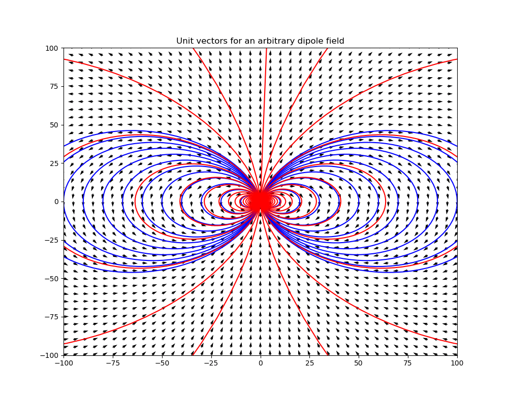
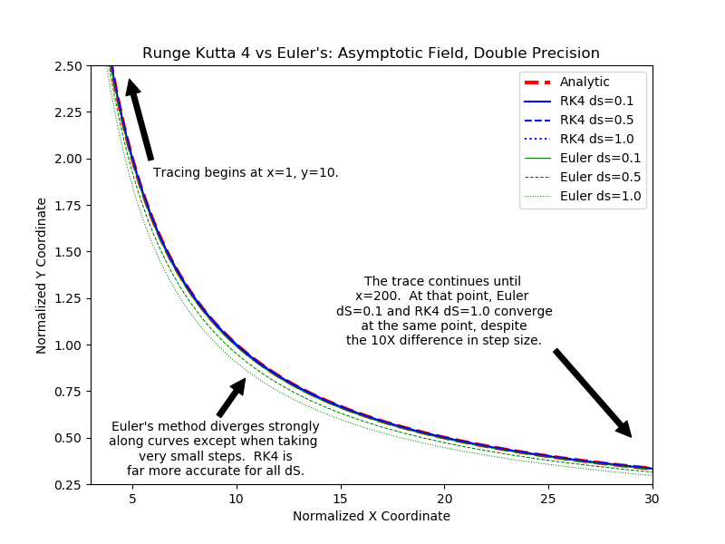
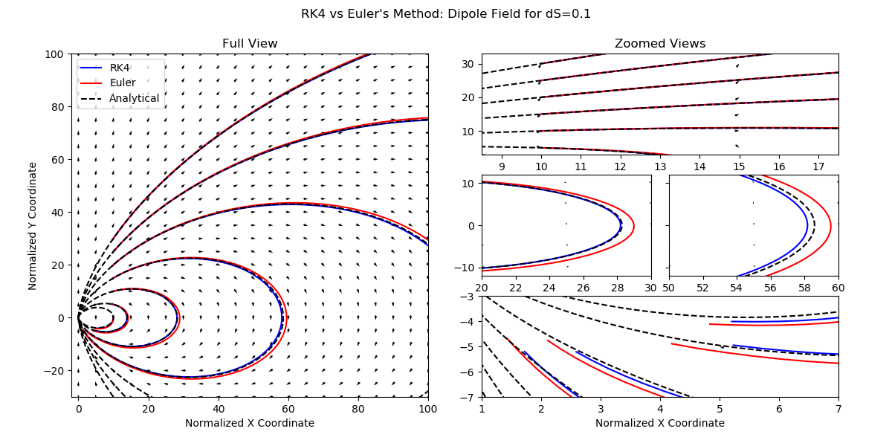

# Examples

## IDL format output processing

The data loader examples are in [SWMF.jl](https://henry2004y.github.io/SWMF/dev/man/examples/). You can use all the functions in `SWMF.jl` by, e.g., `VisAna.readdata`, or you can just import the `SWMF.jl` package.

A general `plotdata` function is provided for quick visualizations. In addition to that, some plotting functions can be directly called as shown below, which allows for more control by the user.

- 1D binary
```
plotdata(data[1], head[1], "p", plotmode="line")
plotdata(data[1], head[1], "p", plotmode="linegrid")
```

- 2D Cartesian (structured)
```
plotdata(data[1], head[1], "p bx;by", plotmode="contbar streamover")
plotdata(data[1], head[1], "p bx;by", plotmode="contbar quiverover")
plotdata(data[1], head[1], "p bx;by", plotmode="contbar streamover", density=2.0)
plotdata(data[1], head[1], "p", plotmode="grid")
plotdata(data[1], head[1], "p", plotmode="contbar", plotrange=[-50., 50., -1., 1.])
plotdata(data[1], head[1], "p", plotmode="contbar")
plotdata(data[1], head[1], "p", plotmode="contbarlog")
plotdata(data[1], head[1], "p", plotmode="surfbar")
```

- 2D unstructured
```
plotdata(data[1], head[1], "rho", plotmode="contbar")
plotdata(data[1], head[1], "rho", plotmode="trimesh")
plotdata(data[1], head[1], "rho", plotmode="tricont")
```

- 2D structured spherical coordinates
```
plotdata(data[1], head[1], "rho", plotmode="contbar")
```

- 3D box
```
plotdata(data[1], head[1], "bx", plotmode="contbar", cut="y", cutPlaneIndex=1, level=20)
plotdata(data[1], head[1], "bx", plotmode="contbar", cut="y", plotrange=[-1.4,-1.1,0.70,0.78])
using PyPlot
plt.axis("scaled")

subplot(2,2,(1,3))
cutplot(data[1],head[1],"Ex", cut='y', cutPlaneIndex=128, plotrange=plotrange)
```

## Multiple dispatch for matplotlib functions
- line plot
```
plot(data[1], head[1], "p", linewidth=2, color="green")
c = plot(data[1], head[1], "p")
plt.setp(c, linestyle="--", linewidth=2);
```

- scatter plot
```
scatter(data[1], head[1], "p")
```

- contour
```
# 2D contour
contour(data[1], head[1], "p")
```

- filled contour
```
contourf(data[1], head[1], "p")
contourf(data[1], head[1], "p", levels, plotrange=[-10,10,-Inf,Inf], plotinterval=0.1)
```

- surface plot
```
plot_surface(data[1], head[1], "p")
```

- triangle surface plot
```
plot_trisurf(data[1], head[1], "p")
```

- triangle filled contour plot
```
tricontourf(data[1], head[1], "p")
```

- streamline
```
streamplot(data[1], head[1], "bx;bz")
streamplot(data[1], head[1], "bx;bz", density=2.0, color="k", plotinterval=1.0, plotrange=[-10,10,-Inf,Inf])
```

## Streamline tracing

The built-in `streamplot` function in Matplotlib is not satisfactory for accurately tracing streamlines. Instead in VisAna we have native support field tracer.

[dipole.jl](https://github.com/henry2004y/VisAnaJulia/blob/master/src/dipole.jl) is used for analytically generate a dipole field:
```
test_dipole()
```
which will show the following figure



Tracing along an asymptotic line
```
test_trace_asymptote()
```
in turn gives


Tracing lines in a dipole field
```
test_trace_dipole()
```
in turn gives


Currently the tracing only works on a uniform structured grid.

An example of tracing in a 2D cut and plot the field lines over contour:
```
using VisAna, PyPlot

filename = "y=0_var_1_t00000000_n00000000.out"
head, data, list = VisAna.readdata(filename,dir="test")

bx = data[1].w[:,:,5]
bz = data[1].w[:,:,7]
x  = data[1].x[:,1,1]
z  = data[1].x[1,:,2]

seeds = select_seeds(x,z; nSeed=100) # randomly select the seeding points

for i = 1:size(seeds)[2]
   xs = seeds[1,i]
   zs = seeds[2,i]
   # Tracing in both direction. Check the document for more options.
   x1, z1 = trace2d_eul(bx, bz, xs, zs, x, z, ds=0.1, maxstep=1000, gridType="ndgrid")
   plot(x1,z1,"--")
end
axis("equal")
```
which will display


Currently the `select_seeds` function uses pseudo random number generator that produces the same seeds every time.

## Space data analysis

In the [space](../../../space) folder, you can find scripts for comparing magnetic field with observations, cross polar cap potential analysis, diamagnetic current calculation, 1D data frequency analysis, minimum variance analysis, particle phase space distribution plots, cut plots near the X-line reconnection site, and static satellite analysis.
