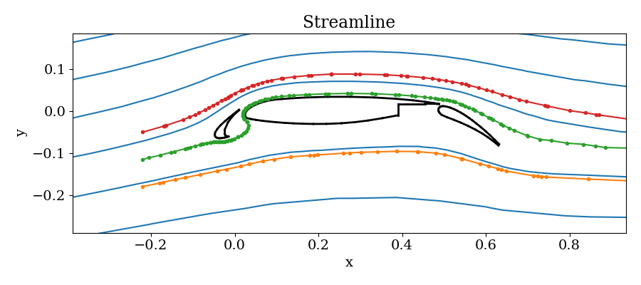

# Streamline and Trajectory

Streamline and trajectory are related topics in physical modeling, common seen in fluid and particle simulations.
In the future, the stream tracing should become a stand-alone package!

## Streamline Tracing

First make it work, then make it better and fast.

I found an approach called Pollock method.

I need an adaptive step control integration scheme like rk45.

### Tracing on Unstructured Grid

Given an unstructured grid with node points and connectivity, how should you do the streamline tracing?

Brute force algorithm:
1. find the grid cell you are currently in;
2. move along the vector direction until you hit the boundary of that cell;
3. find the neighbour who shares the same edge;
4. use the vector direction in the next cell and move along that direction;
5. repeat 2-4 until you hit the preset stopping criteria.

Some questions during the process:
* How to find the neighbouring cell?
* How to determine which boundary edge will you cross?
* How to improve the search speed?
* How to improve accuracy?

A package called `UnstructuredGrids.jl` already exists. I take advantage of this package and quickly build a 2D stream tracer on unstructured 2D grid.

My first implementation follows a very simple scheme:
1. find cell index for the starting points
2. find corresponding cell value
3. find the crossing edge and intersection point
4. find the neighbor who shares the edge
5. repeat 1-4 until you either hit the boundary, exceed `MaxIteration`, or
exceed `MaxLength`.

Actually, this may not be as bad as you think in terms of accuracy. Finite volume method uses one value per cell to represent the solution space, therefore it is just cheating to use higher order method for stream tracing.

An example is shown for the 2D streamline tracing in the unstructured triangular mesh for the famous airfoil problem. The blue lines are the analytic stream functions derived from incompressible Euler equations which are calculated numerically. Three colored lines are displayed with dots representing the footprint inside each cell.

An extension to 3D is possible, and is WIP.

### Matlab

There is an implementation of streamline tracing in Matlab called tristream. It requires nodal data.

Inside the function, there is an intrinsic function called `pointLocation`, which returns the index of cell where the point locates.

### yt

There is another implementation in yt library, which has many similarities to the one I borrowed from SpacePy.

Streamlining through a volume is useful for a variety of analysis tasks. By specifying a set of starting positions, the user is returned a set of 3D positions that can, in turn, be used to visualize the 3D path of the streamlines. Additionally, individual streamlines can be converted into `YTStreamline` objects, and queried for all the available fields along the streamline.

The implementation of streamlining in yt is described below.

1. Decompose the volume into a set of non-overlapping, fully domain tiling bricks, using the `AMRKDTree` homogenized volume.

2. For every streamline starting position:

  * While the length of the streamline is less than the requested length:

    1. Find the brick that contains the current position

    2. If not already present, generate vertex-centered data for the vector fields defining the streamline.

    3. While inside the brick

      1. Integrate the streamline path using a Runge-Kutta 4th order method and the vertex centered data.

      2. During the intermediate steps of each RK4 step, if the position is updated to outside the current brick, interrupt the integration and locate a new brick at the intermediate position.

3. The set of streamline positions are stored in the `Streamlines` object.

### VTK Implementation

In the VTK library, there is a class called `vtkPointLocator`. It is a spatial search object to quickly locate points in 3D. `vtkPointLocator` works by dividing a specified region of space into a regular array of "rectangular" buckets, and then keeping a list of points that lie in each bucket. Typical operation involves giving a position in 3D and finding the closest point. It supports both nodal data and cell data.

`vtkPointLocator` has two distinct methods of interaction. In the first method, you supply it with a dataset, and it operates on the points in the dataset. In the second method, you supply it with an array of points, and the object operates on the array.

!!! note
    Many other types of spatial locators have been developed such as octrees and kd-trees. These are often more efficient for the operations described here.

## Particle Tracing

I have a plan of incorporating particle tracing into this module. WIP
